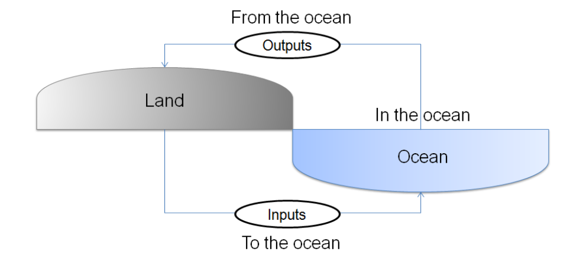
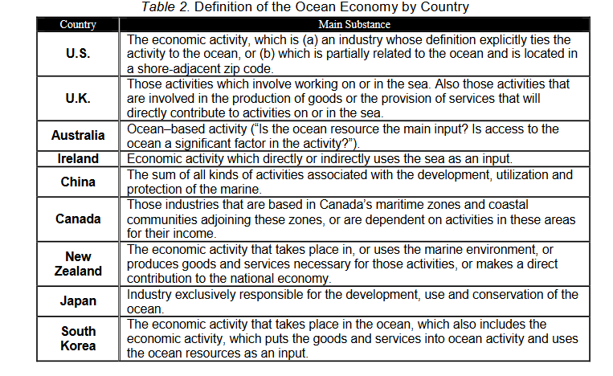
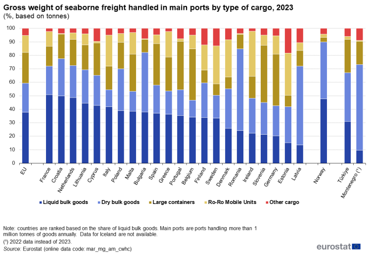
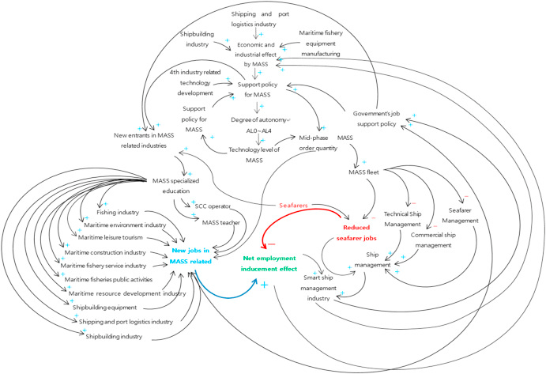

## Introduction

L’économie maritime est une composante essentielle de l’économie mondiale. De la pêche et du tourisme à l’énergie offshore et au transport maritime, elle soutient des millions d’emplois dans des secteurs et des régions très variés. Pourtant, il n’existe pas de vision partagée à l’échelle internationale de ses contours et du nombre de personnes employées dans l’économie de la mer. En France, l’Insee n’est pas le seul service statistique à s’intéresser au sujet et sa méthodologie se confronte régulièrement aux positions/considérations divergentes des acteurs locaux, ce qui limite la comparabilité et la complémentarité des études. 
Les raisons de cette absence de normes sur ce qu’est l’économie maritime, son étendue et les méthodes d’estimation constituent la première partie de cette revue de littérature. Dans un second temps sont étudiées les facteurs susceptibles d’influencer tant le volume d’emplois que leurs caractéristiques et de mettre en lumière les potentielles futures transformations du marché du travail dans ce secteur.

## Partie 1 : Qu’est-ce que l’économie maritime ?

Cette partie est consacrée à l’exploration du terme d’économie maritime. L’approche est progressive : on part de l’analyse même de l’expression, puis on en identifie les secteurs. Enfin, on rend compte des méthodologies possibles pour étudier ce secteur. L’intérêt de cette partie est notamment de mettre en valeur les divergences internationales et la diversité des points de vue. 

### A - Définir l’« économie maritime »

L’Insee désigne par « économie maritime » les activités utilisant les ressources marines ou qui ne pourraient exister sans la mer. Cette définition est le résultat d’un consensus avec le SDES et elle se base sur celle de l’Ifremer. Aujourd’hui, il n’existe pourtant pas de dénomination commune à ce que l’on appelle « économie maritime » dans le monde. Bien au contraire, on trouve une constellation de termes différents pour parler de ce secteur : économie maritime, blue economy, ocean & coastal economy, maritime industry, marine economy… Aujourd’hui, le plus populaire est l’« économie bleue » (cf. table 2) ;  notamment parce qu’il a été mis en avant par le gouvernement américain [U.S. Senate Committee on Commerce, Science, and Transportation, 2009] et la Commission européenne [European Commission, 2012], puis repris ensuite par les grandes institutions internationales (Banque mondiale, Nations Unies…) et les chercheurs. Cependant, l’usage du terme « économie bleue » n’est pas neutre :
- d’une part, il ne suppose rien sur la méthodologie et la classification des activités de l’économie maritime ;
- d’autre part, il a été proposé initialement par un industriel belge pour discuter d’une croissance soutenable et inclusive. Mais l’inclusion de secteurs polluants dans la définition (gaz et pétrole offshore), les acteurs impliqués (industriels et institutions économiques internationales) et le contexte d’émergence du terme (en pleine sortie de la crise de 2008) lui ont valu des critiques. L’expression « économie bleue » était alors mobilisée de façon quasi indissociable avec la notion de « croissance bleue »$^{1}$. 

<u>Critiques sur l’économie bleue</u>

Depuis l’apparition du terme, l’« économie bleue » a rapidement été soutenue par les institutions internationales et de nombreux programmes pour faire de cette vision une réalité. On compte notamment des initiatives d’institutions (ONUAA, Banque Mondiale...) ou encore de fondations philanthropiques (Waitt Institute,…). La vision d’une « croissance » « soutenable » et « inclusive » a été promu lors de la conférence des Nations unies sur le développement durable 2012 (dite Rio+20). C’est aussi là que le concept s’est adjoint aux politiques de développement destinées aux PEID (petits États insulaires en développement). La réalité sur le terrain semble pourtant montrer que l’aspect « croissance » prend le pas sur la soutenabilité et l’inclusivité des populations locales. Le rapport du Transnational Institute, un think-tank, cite quelques exemples marquants :
- Au large de Kiribati (république insulaire d’Océanie), des permis pour l’exploitation minière en eaux profondes ont été délivrés alors que l’activité contribue à la dégradation de l’environnement et au réchauffement climatique. La région possède des ressources importantes en terres rares qui sont nécessaires à la transition aux énergies renouvelables (pour les batteries d’éoliennes, les panneaux photovoltaïques…), d’où son inclusion dans l’économie bleue.
- En Turquie, des changements réglementaires ont encouragé la concentration des exploitations dans l’aquaculture en bloquant les demandes de financement pour les petites exploitations plus traditionnelles.
La liste d’exemples est longue. Un tribunal indépendant international, rassemblant des tribunaux populaires de 5 pays autour de l’océan Indien, a émis un jugement spécial sur l’économie bleue :  accaparement illicite des biens communs océaniques et côtiers, marginalisation des communautés autochtones, destruction et dégradation des écosystèmes océaniques et côtiers...

Attention : ce qui est critiqué, ce n’est pas directement la dénomination technique d’« économie bleue » mais son statut d’étendard à une idéologie controversée.

Sources : Phillipa, 2025 ; TNI, 2019 ; International Independant Tribunal on Blue Economy, 2021.

Si chaque pays, chaque agence retient sa propre dénomination, on peut isoler un concept clé assez commun : l'économie maritime traite des activités économiques du secteur public et privé qui se déroulent directement ou indirectement dans l'océan et/ou la mer, reçoivent des produits de l'océan et/ou la mer et fournissent des biens et des services à l'océan et/ou la mer [Park and Kildow, 2014].

Néanmoins, quelques divergences subsistent quant au champ d’application de l’économie maritime :
-  Les comparaisons internationales sont relativement limitées, car les classifications des entreprises changent complètement d’un pays à l’autre
- L’Ifremer classe les centrales à combustibles fossiles et nucléaires et les éoliennes dans l'économie maritime, ce qui n'est le cas d'aucun autre pays. Cette catégorisation découle de l'hypothèse selon laquelle les unités de production d'électricité sont situées sur les côtes.
- Les États-Unis incluent les Grands Lacs au-contraire du Canada
- L’Australie exclut le secteur public

Les énoncés des différentes définitions à travers le monde sont reportées dans le tableau suivant [Park and Kildow, 2014] :

Le débat sur la dénomination de l’« économie maritime » est essentiellement technique. Le choix de l’expression est pratique avant d’être scientifique ou idéologique et impacte généralement peu le cœur de sujet des études. Un accord au niveau supranational serait pourtant bénéfique pour la clarté.
**[...]**

### B – Les secteurs de l’économie maritime

Une classification de l’ensemble des secteurs de l’économie maritime est tout de même plus aisée pour prendre conscience de l’ampleur de ce pan de l’économie. Voici, par exemple la classification de l’Ifremer :

| **Secteurs**  | **Catégories** |
| ----- | --- |
| Secteur industriel |   |
| Produits de la mer   | Pêche marine, aquaculture marine (pisciculture et conchyliculture), production d'algues, marchés aux poissons et commerce du poisson,
industrie de transformation des produits de la mer  |
|Extraction de granulats marins |Sables et graviers siliceux, sables et sédiments calcaires|
|Production d'électricité|Centrales électriques conventionnelles à combustibles fossiles, centrales nucléaires, éoliennes Construction et réparation navales Construction de ports, de barrages, de digues et de canaux navigables, équipement naval et construction de bateaux Centrales nucléaires, Éoliennes|
|Construction et réparation navales|Construction et réparation de navires marchands et militaires, armement naval et construction de bateaux|
|Génie civil maritime et fluvial|Construction de ports, de barrages, de digues, de canaux navigables, de réserves d'eau, d'écluses et d'autres installations de régulation des cours d'eau / Exécution des travaux : en eau (construction de batardeaux, construction des piles de ponts), dragage, sous-marin (par plongeur ou autres moyens) / Nettoyage des tranchées et aménagement des berges et coupe des herbes aquatiques|
|Câbles sous-marins|Fabrication, pose et entretien de câbles sous-marins immergés en profondeur et, en général, enterrés, destinés à transporter des communications ou de l'énergie électrique|
|Industrie pétrolière et gazière offshore|Fourniture de services et d'équipements liés au pétrole et au gaz dans les domaines de l'exploration et de la production, du raffinage et de la pétrochimie|
|Tourisme littoral|Dépenses des touristes résidents et non-résidents dans les activités touristiques caractéristiques : dépenses d'hébergement, de restauration, de forfaits tout compris (pour les non-résidents), dépenses liées aux séjours : dépenses alimentaires, achats divers, déplacements sur place (taxi ou transports en commun), services aux particuliers, loyers fictifs|
|‍Transports maritimes et fluviaux|Exploitation et organisation générale des ports, Services portuaires aux navires et aux marchandises|
|‍Assurances maritimes|Assurances maritimes et banques|
|‍Secteur public non marchand|     |
|‍Marine nationale, Défense nationale|Intervention publique Économique et sociale (régime social des marins, protection sociale), Réglementation et éducation|
|‍Protection de l'environnement côtier et marin|Prévention, réduction et élimination des pollutions ; la réparation des dommages et l'acquisition, le traitement et la circulation de l'information sur l'environnement|
|‍Recherche marine|Activités des organismes publics français dans le domaine de la recherche marine et de l'océanographie opérationnelle|

Dans ce tableau, plusieurs secteurs se distinguent.

Le tourisme littoral est le 1er poste de l’emploi de l’économie maritime en région PACA en représentant près de 70 % des emplois concernés [Insee, 2017]. Pourtant, de nombreuses études ne l’inclut pas, c’est notamment le cas du CMF (Cluster Maritime Français). L’ouvrage collectif Mare economicum reconnaît ainsi que « le tourisme littoral est curieusement assez peu analysé par les économistes malgré son poids économique de premier plan, peut-être en raison de son caractère pluriel qui le rend si difficile à appréhender » [Guillotreau, 2008]. En effet, le tourisme a une caractéristique propre : on considère une activité comme touristique non pas en fonction de la production mais en fonction de sa clientèle. Or, de nombreuses activités ne dépendent pas que du tourisme pour fonctionner. Comment alors définir cette part touristique, pour un restaurant qui accueille dans la même journée des habitants locaux et des touristes ou pour un hôtel qui héberge des voyageurs d’affaires et des vacanciers ? De plus, des estimations exactes sont difficilement réalisables, l’activité touristique étant périodique et les PME-TPE en nombre important. La question est encore plus délicate si on veut s’intéresser au tourisme littoral. Comment isoler l’activité touristique liée à la mer dans des communes qui proposent également des activités qui ne sont pas maritimes (ex : festival, musées…) ? **[...]**

Or, en raison de l’ampleur du tourisme, des choix méthodologiques divergents peuvent avoir un impact conséquent sur l’estimation du volume d’emploi.

La Marine nationale est aussi un secteur unique en raison de son poids important (2ᵉ poste d’emploi [Insee, 2017]) et des rares données accessibles. En effet, seul le Ministère des Armées diffuse des informations sur le corps militaire français en raison du secret Défense. Les publications sur l’effectif de la Marine nationale et sa composition sont sporadiques, tant en matière de régularité que de contenu. Difficile donc de mener des analyses poussées sans un accord avec la Défense.

Enfin, ce tableau n’est pas complet. Il reste des activités méconnues ou dont il est difficile de quantifier l’aspect maritime. Dans le secteur de la culture, la réalisation de films et de livres autour de la mer et de l’océan mobilisent des équipes employées par des sociétés de production et d’édition qui ne sont pas spécialisés dans l’environnement maritime. On pourrait aussi ajouter les data centers, qui s’installe au bord de mer pour refroidir les serveurs. On en recense 19 en PACA dont 5 installés dans le port de Marseille-Fos. Leur inclusion suivrait la même logique que celle des centrales électriques.

### C – La méthodologie de l’économie maritime

Jusqu’à présent, nous avons observé comment les services statistiques à travers le monde définissent ce à quoi doit correspondre l’économie maritime. Il vient maintenant le temps de confronter ce premier travail à la réalité du secteur. Le choix de la méthodologie est déterminant car elle influe grandement sur ce qu’il y aura dans la base de données. 

Globalement, les instituts de statistiques publiques s’appuient tous sur un système de nomenclature des entreprises : en France, c’est la NAF. Cette nomenclature permet d’isoler déjà tous les emplois qui intègrent clairement une composante maritime, car leurs désignations portent les mots « nautique », « marin » ou encore « portuaire ». 

Cependant, l’un des grands enjeux de la méthodologie est de déterminer quelles sont les activités « partiellement maritimes », c’est-à-dire celles qui appartiennent au périmètre de l’économie maritime sans en constituer le cœur d’activité. Par exemple, l’activité d’une cimenterie n’est pas maritime a priori, l’activité « fabrication de ciment » n’ayant pas de lien avec les ressources marines. Cependant, si ladite cimenterie participe à la construction de fondations gravitaires pour les éoliennes offshore, elle a un lien avec l’économie maritime.

Plusieurs approches sont possibles :
- **[...]**
- L’exploitation du TES (Tableaux Entrées-Sorties) :

Le tableau des entrées-sorties (TES) est l’un des outils des comptes nationaux. Il analyse chacun des produits de la nomenclature NAF selon son origine (production nationale ou importations) et sa destination (consommation intermédiaire, consommation finale, exportations, investissements). Pour chaque produit, le TES établit l’équilibre comptable entre ressources et emploi. En anglais, on parle d’input-output tables ou de supply-use tables. Ce tableau est publié chaque année par l’Insee.
Source : CESER, 2014.

Le Nomura Research Institute au Japon se base sur une analyse input-output et établit qu’une entreprise appartient au périmètre de l’« industrie maritime » si plus de 10 % des intrants d’une industrie sont utilisés pour des activités en lien avec la mer [NRI, 2009 (non-disponible en ligne)].

Le NOEP (puis le BEA son sucesseur) aux États-Unis effectue un premier filtrage géographique des activités « potentiellement maritimes » si le code postal est associé à au plus un comté « shore-adjacent » au rivage [méthodologie du NOEP rédigée par Colgan, 2007]. Ainsi, les codes postaux ont été modifiés pour identifier les zones cotières après le Coastal Zone Management Act [NOAA, 1972].

<u>Les zones côtières aux États-Unis</u>

La définition de l’économie côtière de NOEP repose sur une approche par paliers. Les définitions des niveaux sont basées sur les codes postaux et les limites des comtés. Les catégories suivantes sont utilisées en commençant par le littoral et en poursuivant vers l’intérieur des terres :
- *Near-Shore* : établissements ou population situés dans un code postal immédiatement adjacent à un océan, à un grand lac ou à une rivière ou une baie inclus·e.
- *Shore-Adjacent Coastal Zone County* : comtés jouxtant en totalité ou en partie par la zone côtière d’un État selon la loi de 1972 sur la gestion de la zone côtière (Coastal Zone Management Act), telle que définie par cet État, et qui est adjacent à un océan, à un grand lac ou à un fleuve ou une baie inclus·e. Cela inclut les codes postaux proches du rivage.
- *Non–shore-Adjacent Coastal Zone County* : comté jouxtant en totalité ou en partie par la zone côtière d’un État selon la loi de 1972 sur la gestion de la zone côtière, telle que définie par cet État, et qui n’est pas adjacent à un océan, à un grand lac, ou à une rivière ou une baie inclus·e.
- *Coastal Zone Counties* : comtés composés de comtés adjacents au rivage et de comtés non adjacents au rivage.
- *Non-Coastal Zone Watershed County* : comté situé en dehors de la zone côtière, mais à l’intérieur d'un bassin versant côtier.
- *Coastal Watershed County* : un comté situé dans un bassin versant côtier tel que défini par l’U.S. Geological Survey. Les comtés du bassin versant comprennent tous les comtés de la zone côtière et les comtés du bassin versant qui ne sont pas situés dans la zone côtière.
- *Inland County* : comté situé en dehors d’un bassin versant côtier.

Source : méthodologie du NOEP, 2007.

Une fois réalisé ce premier filtrage, le BEA analyse le TES pour identifier les consommations intermédiaires (en entrées) et la marchandise produite (en sortie) qui sont liées à l’économie maritime. Si seule une partie de la production était pertinente pour l'économie maritime, des données supplémentaires étaient nécessaires pour identifier la composante maritime. L'aquaculture est un exemple : l'aquaculture marine a dû être séparée de l'aquaculture d'eau douce, et les données du NOAA Fisheries ont été utilisées pour déterminer la part correcte et l’ajouter à la base de données. 

Pour déterminer la valeur ajoutée, l’emploi et les salaires, les TES donnent des informations à un niveau d’agrégation qui ne permet de distinguer l’économie maritime au sein des industries. L’hypothèse est donc faite que le volume d’emploi, la valeur ajoutée, les salaires […] correspondent à l’application de notre part d’activité maritime précédemment calculée comme un pourcentage des valeurs totales de l’industrie (référencées dans le TES).

Cette hypothèse est assez commune dans les analyses mobilisant un TES, notamment dans la recherche. Des chercheurs polonais [Kwiatkowski et Zaucha, 2023] ont essayé d’appliquer la définition de la Commission européenne avec la nomenclature locale. Ils classifient les activités maritimes en quantifiant l’emploi maritime d’un secteur à partir de la valeur ajoutée des entreprises. Ils considèrent ensuite que la part de la VA des entreprises du secteur dans les régions côtières par rapport à la totalité du pays représente la part de l’emploi du secteur comme faisant partie de l’économie maritime. Petite spécificité : ils ont utilisé les bases de données international Eurostat SBS et Orbis. 

- On trouve encore d’autres méthodes, certains chercheurs utilisent des modèles où le périmètre est prédéfini (on retrouve ce cas dans [Hynes et al., 2021] dans un modèle de microsimulation spatial ou dans [Liang et al., 2025] avec des TES).
  
Enfin, cette liste n’est qu’un aperçu. Elle est non-exhaustive car beaucoup n’explicitent pas leurs techniques de manière précise. Il existe sûrement d’autres méthodologies, qui peuvent combiner les approches précédentes ou utiliser des outils complètement différents.

Surtout, on peut encore caractériser les emplois « induits » par l’économie maritime, dont l’existence peut dépendre des activités maritimes. Par exemple, la valeur ajoutée du secteur de la construction et de la réparation navales est générée par des activités en amont et en aval de la chaîne d'approvisionnement de l'industrie. Cela indique qu'au-delà de la contribution directe du secteur à l'économie maritime, il peut y avoir des effets multiplicateurs significatifs sur le revenu et l'emploi dans d’autres segments de l'économie. L’inclusion des emplois induits est discutable mais elle permet de mieux apprécier l’influence global de la présence de la mer/l’océan sur un territoire.

## Partie 2 : Comment se manifestent les tendances du marché du travail dans l’économie maritime ?

Cette partie se consacre à l’étude des facteurs susceptibles d’influencer l’emploi dans l’économie maritime. 3 évolutions majeures y sont étudiées : les choix de spécialisation des ports et leurs impacts sur l’emploi, l’intégration de l’IA dans les processus de production et la question de la féminisation des emplois. Rares sont les papiers qui traitent de ces sujets sur l’ensemble de l’économie maritime, une analyse filière par filière sera alors menée.

### A - L’impact économique du port sur la région portuaire

Certaines études se sont attachées à étudier l’impact du commerce maritime sur l’activité économique portuaire. L’intérêt étant d’observer comment et sous quelles formes une variation du débit du port$^{2}$ influence les dynamiques d’emploi. En effet, une augmentation du débit génère une demande pour une série de services comme la manutention des marchandises, le transport, l'entreposage, l'administration portuaire et le dédouanement, ce qui crée des opportunités d’emploi pour les travailleurs qualifiés et non qualifiés. Une étude de l’OCDE en 2013, portant sur 116 ports à travers le monde, trouve une corrélation positive entre le débit du port et le niveau d’emploi. Pour cela, les auteurs estiment une série d’équations d’emploi par la méthode des moments généralisée (GMM). 

<u>La méthode des moments généralisée (GMM)</u>

Le modèle de base

La méthode généralisée des moments (GMM) est une technique statistique utilisée pour estimer les paramètres dans les modèles économétriques. Il est particulièrement utile dans les situations où les méthodes traditionnelles, telles que l'estimation du maximum de vraisemblance (MLE), peuvent être difficiles à appliquer en raison de la complexité du modèle ou de la nature des données.
Au cœur de GMM se trouve l'idée de conditions de moment, qui sont des équations qui relient les paramètres du modèle aux valeurs attendues de certaines fonctions des données. Ces conditions de moment sont généralement dérivées de la théorie économique sous-jacente ou des propriétés statistiques des données. L'estimateur GMM est obtenu en minimisant une somme pondérée des carrés des différences entre les moments d'échantillon (calculés à partir des données) et les moments de population (impliqués par le modèle). Ce processus de minimisation permet aux chercheurs de trouver des estimations de paramètres qui correspondent le mieux aux données observées en fonction des conditions de moment spécifiées.
Le GMM est largement utilisé en économétrie pour estimer des modèles impliquant des données de séries chronologiques, des données de panel et des données transversales.

Source : article en français sur le GMM

La variante mobilisée par les études citées

Lié aux caractéristiques des données exploitées, les 2 études susmentionnées utilisent l’estimateur SYS-GMM de Blundell et Bond. En combinant des équations en différences avec des équations en niveaux, le système GMM améliore l'estimateur standard Différence GMM en fournissant des estimations plus efficaces et impartiales, en particulier lorsque les variables indépendantes sont faiblement exogènes. Du point de vue d'un économètre, l'intérêt du Système GMM réside dans sa capacité à fournir des estimateurs cohérents même lorsque les variables explicatives ne sont pas strictement exogènes.

Sources : autre article en français sur le SYS-GMM ; papier référence de Blundell et Bond, 1998.

Équations d’emploi

Les équations d’emploi varient selon les papiers. L’une des plus légères et qui a inspiré les papiers suivants est celle de l’étude de l’OCDE :

$$ln Emp_{it} = α ln Emp_{it-1} + Y’β + X’γ + u_{it}$$

« Où $ln Emp_{it}$ représente le logarithme du nombre de personnes employées dans la région i au moment t ; $ln Emp_{it-1}$ est le premier décalage de l'emploi, qui est inclus étant donné que les coûts d'ajustement de l'emploi empêchent des ajustements instantanés à l'équilibre à long terme ; Y est un vecteur d'activités portuaires, composé du nombre de passagers qui ont utilisé les ports de la région i au moment t, et du débit d'un port ou, selon la spécification du modèle, du débit net dans la région i au moment t ; à son tour, X est un vecteur de variables de contrôle régionales et $u_{it} = e_{i} + t_{t} + v_{it}$ est un terme d'erreur. Le terme d'erreur est composé de e_{i}, un ensemble d'effets fixes spécifiques à la région, potentiellement corrélés avec les variables de régression, qui capture les effets de l'hétérogénéité régionale non observée dans le temps, telle que les institutions, les niveaux de développement économique, la structure et la composition de l'économie régionale, etc. » (Traduction libre)

Source : Bottasso et al., 2013

Leurs résultats indiquent qu’une augmentation d'1 point de % du débit portuaire est associée à une augmentation de l'emploi dans la région portuaire de 0,03 point de % à court-terme et de 0,75 point de % à long-terme. Des travaux similaires et plus récents ont été réalisées sur des échantillons plus localisés. Les résultats sont résumés dans le tableau ci-dessous.

| Auteurs  | Région Étudiée | Méthode | Court-terme (%) | Long-terme (%) |
| ----- | --- | ---------- | ---------- | ---------- |
|Bottasso et al., 2013 (OCDE)|OCDE|GMM|+ 0,03|+ 0,75|
|Ayesu et Boateng, 2024 |Afrique|GMM|+ 0,07|+ 1,32|
|Hidalgo-Gallego et Núñez-Sánchez, 2023|Espagne|Tobit|+ 0,02 - + 0,03|
|Seo et Park, 2018|Corée du Sud|Tobit|  + 0,08 |N/A|

Variations du niveau d’emploi pour une augmentation de 1 % du débit portuaire

Par ailleurs, l’étude de l’OCDE différencie ses résultats selon le type de navires de charges/cargos (les types dépendent des marchandises) : le vrac liquide se distingue particulièrement en ayant un impact positif mais très inférieur aux autres catégories (vracs secs, porte-conteneurs, rouliers/Ro-Ro…). Selon les auteurs, cette variation provient de la nature du vrac liquide (pétroliers notamment) qui ne nécessite pas beaucoup de main-d’œuvre grâce au transport par pipeline. La France est un leader européen en termes de spécialisation dans ce type de marchandises.

### B – La place de l’Intelligence Artificielle (IA) dans l’économie maritime

Les récents développements de l’IA générative et de la robotique attirent régulièrement l’attention des médias, partagées entre la crainte d’une automatisation de nombreuses tâches et donc la disparition de certains métiers et l’espoir d’une coopération homme-machine vers un travail plus efficace. Aucun papier récent ne traite du sujet sur l’ensemble de l’économie maritime, mais il est possible de trouver des études sur quelques filières en particulier. La Commission européenne, en s’appuyant sur une étude générale dans le secteur des transports, met en avant qu’un haut risque d’automatisation$^{3}$ pourrait touché entre 5,7 et 50 % des emplois peu qualifiés (ex : ouvrier portuaire, bagagiste) entre 7 % et 23 % des emplois moyennement qualifiés (ex : gens de mer, chauffeurs poids lourds) et maximum 2 % pour les emplois hautement qualifiés (ex : officiers de navires, personnel spécialisé). 

#### I. Transport maritime 

Le secteur du transport maritime en incluant tout ce qui touche la gestion et à la maintenance des cargos est l’une des filières les plus prometteuses sur le sujet. Une révolution est attendue avec le développement des MASS (Maritime Autonomous Surface Ships) : un cargo autonome sans équipage à bord qui peut se commander à distance voire être complètement indépendant. Les premiers modèles sont aujourd’hui en phase de test. L’un des pays leaders sur la question est la Corée du Sud qui a un plan d’investissement de presque $2Mds dans la construction navale de nouvelle génération avec pour ambition notamment la commercialisation d’une dizaine de MASS pour 2035. La littérature scientifique s’est donc intéressée à ce cas particulier. Par une application de la méthode de la dynamique des systèmes (SD), Jo & D'agostini, 2020 ont simulé l’impact de l’introduction des navires autonomes et trouvé que la destruction d’emplois chez les marins serait largement compensée par une forte création d’emplois dans l’industrie navale.

<u>La dynamique des systèmes (System Dynamics ou SD en anglais)</u>

La dynamique des systèmes est une technique de modélisation mathématique qui permet de comprendre le comportement des systèmes complexes dans le temps en les représentant par des systèmes dynamiques. Le SD analyse les augmentations ou les diminutions des valeurs des variables spécifiques à un problème au cours d'une période donnée. Elle a été créée au milieu des années 1950 par le professeur Jay Forrester du MIT. Elle prend en compte les boucles de rétroaction internes et les effets retard qui affectent le comportement global du système. En dynamique des systèmes, faire tourner une simulation consiste à résoudre les équations mathématiques pour obtenir la valeur de chaque variable au cours du temps. Les équations contiennent des paramètres qu’il faut souvent calibrer sur des données historiques. La sortie d’une simulation pour un jeu de données d’entrée fixé s’appelle un scénario. World3, le modèle de simulation sur lequel se base le rapport Meadows est un modèle de SD.

Les approches SD sont principalement divisées en approches impliquant des diagrammes de boucle causale et des diagrammes de flux de stock. Les diagrammes de boucle causale, qui ont été développés comme un outil de pré-simulation informatique, sont utilisés pour améliorer la compréhension d'un modèle par les parties prenantes à la résolution du problème. Les diagrammes de flux et de stocks comprennent les relations de cause à effet entre les variables liées à des problèmes spécifiques. Par exemple, voici le diagramme de boucle causale de l’étude de Jo & d’Agostini :

Sources : Provitolo, 2006 ;  Jo & D'Agostini, 2020 ; article de référence de Forrester, 1961.

Une revue de littérature récente sur les perspectives du métier de naviguant [Li, 2024] corrobore ce point de vue tout en déplorant l’insuffisance de recherches de qualité sur le sujet. Surtout, ces auteurs anticipent que ce nouveau marché va renverser le marché du travail international du transport maritime. En effet, les équipages viennent en majorité de pays comme les Phillipines, Myanmar ou encore l’Inde. Les compétences nécessaires à l’accueil et la gestion des MASS privilégieront une relocalisation des emplois dans les ports des pays développés et leurs orientations vers des techniciens très qualifiés [Jo & D'agostini, 2020 ; Kim, 2018]. Toutefois, cela reste des perspectives à long- voire très long-terme. Il faudrait encore plusieurs dizaines d’années pour renouveler les 110 000 navires de la flotte marchande actuellement en circulation.

#### II. Tourisme

Malgré la tendance actuelle à appliquer l'IA à un grand nombre de domaines, son développement dans le secteur du tourisme a été moins important [Duarte et al., 2020]. Pourtant, les domaines d’application de même que le potentiel existe : systèmes de recommandations, guides personnalisées, prédictions et planification touristique [Alzahrani et al., 2025]. L’un des leaders mondial du secteur, Amadeus$^{4}$, est d’ailleurs implantée en Région PACA. Il faut noter que le secteur se prête assez mal à ces évolutions dans l’inconscient collectif : il est difficile d’imaginer remplacer les métiers de l’hôtellerie-restauration ou de l’animation de loisirs par des robots (cf. encadré ci-dessous).

<u>L’IA et les robots peuvent-ils vraiment transformer le tourisme ?</u>

Plusieurs facteurs tendent à relativiser l’impact de ces technologies sur l’emploi dans ce secteur. Du côté des employeurs, il y a de nombreux freins à l’adoption des robots et de l’IA dans leurs services. Une enquête auprès de plus de 1000 hôtels de 5 pays européens (dont la France) pointent l’importance de l’investissement nécessaire, de même que le manque de connaissances et de compétences techniques et les difficultés d’implémentation dans le système existant. Des difficultés exacerbées par la petite taille de certains prestataires touristiques qui sont souvent unipersonnels. Du côté des clients, deux enquêtes (respectivement dans la restauration et la conciergerie hôtelière) révèlent que les attentes sont plus basses lorsque le service est réalisé par un robot que par un humain.

Sources : enquête de l’HES•SO, 2023 ; article d’un directeur d’office du tourisme girondin, 2024 ; Ye et al., 2022 ; enquête restauration de Byrd et al., 2021; enquête hôtellerie de Shin et Jeong, 2020.

### C – La féminisation des emplois dans l’économie maritime

La question de la parité homme-femme se pose particulièrement dans l’économie maritime car, hors tourisme et Marine nationale, c’est l’un des secteurs les moins féminisés en France. En région PACA, la dernière étude de l’INSEE révèle ainsi que 3/4 des salariés de l’économe maritime sont des hommes.

#### I. Transport maritime

Les barrières à l’insertion professionnelle des femmes dans le monde maritime sont connues : stéréotypes de genre persistants, écart de rémunération, manque d’adaptation des carrières professionnelles… Historiquement, la présence des femmes dans le milieu maritime était très mal vu. Dans un milieu ultra-masculin, il était d’usage de dire qu’une femme sur un navire est signe de mauvais présages. De plus, la maternité constitue un point de blocage majeur dans l’évolution des carrières des femmes navigantes d’après une note de synthèse de l’ISEMAR. Elles n’atteignent généralement pas le nombre d’années de navigation requises pour prétendre à ces postes gradés. Ainsi, la grande enquête mondiale de 2024 de l’IMO et de la WISTA (rattachés aux Nations Unies) établit que seul 1 % des gens de mer sont des femmes. Sur le port, le tableau n’est guère plus élogieux. La discrimination se fait dans la division du travail et des tâches. Une enquête réalisée sur des ports en France et au Royaume-Uni montre que la profession d’ouvrier docker est quasi- si ce n’est pas complètement -fermée aux femmes. C’est le cas du port du Havre. La différenciation est même légitimée par les lois : l’article R4541-9 du Code du Travail interdit de porter des charges supérieures à 25 kg pour une femme (contre 55 kg pour un homme), ou de mener certains travaux de maintenance (ex : piquage). Cela alors même que les contraintes physiques de ces métiers s’effacent au profit des innovations mécaniques et de l’assistance technique. Il n’y a pas de chiffres publiés sur la part des femmes chez les ouvriers portuaires, cependant, il semble que la filière ne soit pas complètement fermée au GPMM au regard de l’existence de quelques témoignages. On tend tout de même donc à retrouver plus de femmes dans les terminaux de tourisme, la RSE ou encore les soins. De leur côté, les ports communiquent sur l’index d’égalité professionnelle que doivent réaliser toutes les entreprises de plus de 250 salariés. En 2024, le port de Marseille-Fos a obtenu le score de 93/100. Sur la même année, le port du Havre obtient 87/100. L’index est soumis à de nombreuses critiques. 

<u>Critiques sur l’index d’égalité professionnelle</u>

L’index égalité professionnelle a été créé en 2018 avec l’ambition de permettre aux entreprises de mesurer les écarts de rémunération entre les sexes et de mettre en lumière les disparités existantes, afin de lutter contre les inégalités professionnelles. Il donne une note sur 100. En cas de non-atteinte de la note minimale de 75/100, la sanction peut aller jusqu’à 1 % de la masse salariale de l’entreprise.
Le Haut Conseil à l’Egalité entre les femmes et les hommes, dans un rapport publié le 7 mars 2024, dressait le bilan de l’index sur les 5 dernières années. S’il relevait que l’outil avait permis des avancées en matière d’égalité, il soulignait également la subsistance de certaines limites :
- 1 % des entreprises étaient assujetties à l’index, ce qui représentait seulement un quart des salariés ;
- omission du facteur « temps partiel » et mise à l’écart des éléments de rémunérations variables ;
- une note supérieure à 75/100 laissant penser que le problème des inégalités salariales est résolu, alors que les écarts subsistent et donc que l’entreprise peut être condamnée ;
- l’index se limitait au principe d’égalité de rémunération à poste équivalent, n’intégrant ainsi pas la sous-valorisation systématique des métiers féminisés.

La Cour des comptes, dans un rapport publié le 27 janvier 2025, critique plus sévèrement l’index égalité, le qualifiant d’“index de façade dont la logique de résultats n’est pas probante”.

Sources : article de presse de synthèse, 2025 ; Cour des Comptes, 2025 ; Haut Conseil à l’Égalité, 2024.

L’IA et la robotique au service de l’égalité homme-femme ?

Grâce à l’autonomisation des tâches permises par les futures avancées de l’IA et de la robotique, les composantes « masculines » des métiers de la Mer et du port seront atténuées. En effet, ces changements pourraient provenir de l’apparition de nouvelles fonctions qui n’auront pas un « passif de masculinité » au sens qu’elles n’auront pas un historique et une culture (parfois toxique) de métiers masculins. Ils pourraient aussi être la conséquence de la suppression des barrières liées aux tâches physiques et/ou à risques qui freinent l’insertion féminine dans ces métiers. Ainsi, les postes dans ce secteur pourraient ressembler à des emplois de bureau plus traditionnels qui accueillent généralement plus d’effectifs féminins.

Sources : Kim et al., 2019 ; Li, 2024.

#### II. Tourisme littoral

Il n’existe pas d’études sur l’emploi lié au tourisme littoral dans la région PACA. Pourtant, il semble faire figure d’exception sur la question de la féminisation des emplois. Les publications de l’Insee abordant le sujet ont toutes entre 5 et 10 ans mais montre une répartition quasi-parfaite entre hommes et femmes : en % de femmes (salariés), 49 % en France Métro [2015], 1 salarié sur 2 en Bretagne [2018], 54 % en Pays de la Loire [2017], 51 % dans les Hauts de France [2017]… Ce rapport, assez stable, semble aussi se prolonger en Région PACA : une publication récente de l’Insee étudiant le tourisme au global (littoral et non-littoral) porte la part des effectifs féminins à 51 %. 

Cette situation est symptomatique d’un secteur qui concentre beaucoup de métiers très féminisés à l’image de l’accueil, de la communication ou de la vente. C’est une filière où les formations sont courtes, peu qualifiantes et dominées par un public féminin. 

Les femmes dans les formations des métiers du tourisme

Il y a une multitude de parcours scolaires et professionnels qui peuvent mener aux métiers du tourisme car il y a, en sortie, une diversité de métiers aussi grandes qui se rassemblent sous cette étiquette. Un article daté (2006) parle de 85 % d’effectifs féminins en BTS Tourisme et de 80 % à l’IREST (Institut de Recherche et d'Études Supérieures du Tourisme) sans citer ses sources. Plus vieux encore, une mission de l’Inspection générale du tourisme évoquent un rapport de 8:1 pour les femmes en BTS Tourisme en France et un rapport de 20:1 en licence professionnelle de tourisme à la Sorbonne.
Ces chiffres sont datés et peuvent avoir connu des évolutions significatives.

Sources : article de l’Écho Touristique, 2006 ; rapport de la Mission « Femmes et Tourisme », 2003.

Cela n’empêche pourtant pas une sous-représentation des femmes dans certains métiers et parmi les cadres. Pour y remédier, les Entreprises du Voyage et les syndicats ont récemment signé le tout premier accord de branche portant sur l’égalité professionnelle entre les femmes et les hommes (complété par l’accord du 13 décembre 2023 lui-même étendu en 2025). L’une des ambitions affiché par les participants est d’atteindre 70 % de cadres féminins d’ici 2025.

#### III. Produits de la mer

Les Produits de la mer regroupe les activités de la pêche maritime, de l’aquaculture incluant la transformation et le commerce de ces productions.
Le Carif-Oref y a récemment dédié un cahier de filière pour la région PACA. Sur la question de la parité, la pêche est à l’image des autres activités maritimes avec un taux de féminisation de 4 %, et cela malgré un doublement des effectifs féminins en 20 ans. Du côté de l’aquaculture, les femmes sont bien plus présentes avec 30 % de femmes. Ces chiffres masquent toutefois une discrimination horizontale : les effectifs féminins sont très concentrés dans les métiers d’administration, de transformation et de vente et presque complètement absentes du « cœur » de la production aquacole ou de la grande pêche.

<u>La discrimination/ségrégation professionnelle selon le sexe</u>

La théorie distingue parfois deux dimensions de la ségrégation professionnelle (Meulders et al., 2010) : la ségrégation horizontale, qui désigne la concentration ou surreprésentation des femmes (resp. des hommes) dans certaines professions ; et la ségrégation verticale, qui désigne la sous-représentation des femmes (resp. hommes) dans des professions présentant des attributs « souhaitables » (revenus, reconnaissance sociale...).

Source : Document d’études de la Dares, 2019.

## Conclusion

L’économie maritime est une composante essentielle de l’économie mondiale. De la pêche, de la construction navale et du tourisme littoral à l’énergie offshore, aux interventions publiques et au transport maritime, elle soutient des millions d’emplois dans des secteurs et des régions très variés en France. 

**[...]** 
Cette définition n’est cependant pas une référence, ni nationale ni internationale. De nombreux termes différents existent pour désigner ce secteur : économie bleue [Commission Européenne, 2021], économie marine [Bureau of Economic Analysis (USA), 2020], industrie maritime [Allen Consulting Group (Australie), 2004]... 
Cette différenciation se poursuit dans le champ d’application de l’économie maritime, conséquence notamment des différences de classification des secteurs d’activités entre les pays [Park and Kildow, 2014]. On distingue deux types d’emplois à inclure dans l’économie maritime : les emplois directs qui sont clairement liés à l’économie maritime et les emplois indirects qui appartiennent à des secteurs dont le cœur d’activité n’est pas forcément la mer [Ceser, 2014]. Si les emplois directs sont facilement quantifiables, la tâche est plus délicate pour les emplois indirects. Pour les estimations d’emplois directs, deux méthodes dominent : 
- La réalisation d’un travail d’enquête supplémentaire au travers d’expertises et/ou de sondages (comme en Chine [Zhao et al., 2014]).
- L’exploitation des Tableaux Entrées-Sorties (ceux de la France sont publiées par l’Insee) qui établit l’équilibre comptable entre ressources et emploi par nomenclature NAF. Cette méthode nécessite de faire l’hypothèse que la part des emplois liés à l’industrie maritime dans l’industrie totale correspond à la part de la production/valeur ajoutée liée à l’industrie maritime dans l’industrie totale. Elle est utilisée aux USA [BEA, 2020], au Japon [NRI, 2009] et souvent dans la recherche [Kwiatkowski et Zaucha, 2023]. 

L’OCDE avance que si l’économie maritime était un pays, elle serait la cinquième plus grande économie du monde [OCDE, 2025]. Cette importance se répercute sur le marché du travail qui voit près de 120 000 actifs employés dans des activités liées à la mer en région PACA [Insee, 2017]. Plusieurs études ont cherché à quantifier l’influence de l’activité d’un port sur le volume d’emploi dans sa région. Toutes trouvent un impact positif allant d’une hausse de 0,03 % à 0,08 % pour une augmentation de 1 % du débit portuaire [Bottasso et al., 2013 ; Ayesu et Boateng, 2024 ; Seo et Park 2018]. Entre autres, les estimations différenciées selon le type de cargaison donnent un impact positif plus faible du vrac liquide [OCDE, 2012] dans lequel est spécialisé le port de Marseille-Fos. Mais la spécialisation offre des avantages à travers une plus grande productivité et un plus grand attrait commercial [Pérez et al., 2020].

La spécialisation portuaire n’est pas le seul déterminant de l’emploi. Les grandes tendances du marché du travail vont aussi transformer le volume et les caractéristiques du travail dans l’économie maritime. La Commission européenne met en avant qu’un haut risque d’automatisation pourrait toucher entre 5,7 et 50 % des emplois peu qualifiés (ex : ouvrier portuaire, bagagiste) entre 7 % et 23 % des emplois moyennement qualifiés (ex : gens de mer, chauffeurs poids lourds) lié aux progrès de la robotique et de l’IA. Tous les secteurs liés au port et à la marine marchande risquent d’ailleurs d’être impactées avec ces nouvelles innovations. L’une d’entre elles est l’introduction des cargos autonomes (MASS) dans la flotte mondiale qui menace le métier de marin [Li, 2024]. Dans le cadre de la livraison de 10 MASS en Corée du Sud pour 2035, des auteurs estiment cependant que les créations d’emplois (notamment de technicien et d’ingénieurs spécialisés) dépasseront les destructions d’emplois parmi les gens de mer [Jo & D'agostini, 2020]. Le tourisme s’approprie bien moins ces nouvelles technologies [Duarte et al., 2020] malgré un potentiel d’applications important  [Alzahrani et al., 2025]. Une enquête auprès de plus de 1 000 hôtels de 5 pays européens (dont la France) pointe l’importance de l’investissement nécessaire, le manque de connaissances et de compétences techniques et des difficultés d’implémentation [HES•SO, 2023]. 

Enfin, le manque de féminisation des emplois de l’économie maritime est une des grandes voies d’évolution du secteur. Si l’on observe des progrès dans le secteur maritime, l’ISEMAR relève que les freins sociaux (stéréotypes, atmosphère toxique…) et professionnels (inégalité salariale, mauvaise intégration de la période de maternité dans la carrière professionnelle...) sont encore présents [ISEMAR, 2018]. La conséquence est une discrimination verticale qui se résorbe lentement (voir par exemple l’index d’égalité professionnelle du port de Marseille-Fos) mais une discrimination horizontale (surreprésentation d’un sexe dans un métier) qui persiste [Lécuyer, 2022]. Ainsi, la dernière étude l’Insee sur le sujet calcule que seul un quart des salariés de l’économie maritime en région PACA sont des femmes [INSEE, 2019] avec de grandes disparités, même dans des industries très proches : 4 % pour la pêche, 30 % pour l’aquaculture [Carif-Oref, 2023]. Les chiffres ne sont pas disponibles dans tous les secteurs pour la région PACA mais certains métiers, comme ceux de marins ou de dockers, semblent quasiment fermés à un public féminin [WISTA, 2024 ; Lécuyer, 2022]. À cet égard, le tourisme littoral fait figure d’exception : les publications INSEE dans toute la France évoquent une parité homme-femme quasi-parfaite [France métropolitaine, 2015 ; Bretagne 2018 ; Pays de la Loire 2017 ; Hauts de France 2017] qui semble se confirmer en PACA puisque le tourisme au global (littoral et non-littoral) compte déjà 51 % d’effectifs féminins [INSEE, 2023].

> [!NOTE]
> $^{1}$ La plupart des récentes publications n’intègrent plus cette dimension.
> $^{2}$ Débit portuaire = Nombre total des conteneurs manutentionnés estimés par pays, exprimé en équivalent vingt pieds (EVP). Un EVP est l'unité de volume équivalente à un conteneur standard multimodal d'une longueur de vingt pieds, utilisé pour le chargement, le déchargement, le repositionnement et le transbordement [CNUCED]. 
> $^{3}$ Les auteurs parlent d’un « risque élevé d’automatisation » qui correspond à un taux d’« automatibilité » de 70 % des tâches du métier. La méthode se base sur Arntz, Gregory et Zierahn [2016, 2017].
> $^{4}$ Amadeus It Group est aujourd'hui le premier fournisseur mondial de solutions technologiques pour le secteur du voyage. Il contrôle plus de 40 % du marché mondial des GDS (système global de réservation). Amadeus a des bureaux à Sophia-Antipolis. (Source : Les Échos)

## Références

**Partie 1 : Qu’est-ce que l’économie maritime ?**

<u>A - Définir l’« économie maritime »</u>

Ah-Son D., « Des activités en hausse et à forte valeur ajoutée - Économie bleue à La Réunion », Insee Analyses Réunion n° 75, octobre 2022

European Commission, Blue Growth – Opportunities for marine and maritime sustainable growth
– Communication from the Commission to the European Parliament, the Council, the European Economic and Social Committee and the Committee of the Regions (2021) [lien]

International Independant Tribunal on Blue Economy, International Jury Verdict:
Independent People’s Tribunal on the Implications of Blue Economy in Sri Lanka (2021) [lien]

Louey, Philippa Lee. "A transformative blue economy?." (2024). [lien]

OCDE (2025), L’économie de la mer à l’horizon 2050 (version abrégée), Éditions OCDE, Paris, https://doi.org/10.1787/66051cab-fr. 

Park, Dr. Kwang Seo and Kildow, Dr. Judith T. (2014) "Rebuilding the Classification System of the Ocean Economy," Journal of Ocean and Coastal Economics: Vol. 2014: Iss. 1, Article 4. [lien]  

Transnational Institute, Unmasking the Blue Fix (2019) [lien]

U.S. Senate Committee on Commerce, Science, and Transportation, The Blue Economy: The Role of the Oceans in our Nation’s Economic Future, June 9, 2009 09:30 AM, SR 253. 

<u>B – Les secteurs de l’économie maritime</u>

Caray J., Méreau B., « Économie maritime - Des activités à forte valeur ajoutée et des emplois qualifiés », Insee Flash Provence-Alpes-Côte d'Azur n° 56, septembre 2019 
datacenters.com, Provence-Alpes-Cote d'Azur Data Centers Locations [lien] 
Guillotreau, Patrice, éditeur. Mare economicum. Presses universitaires de Rennes, 2008, https://doi.org/10.4000/books.pur.53781.
Meyer V., Novella S., « 120 000 emplois directement liés à la mer en Provence-Alpes-Côte d’Azur », Insee Analyses Provence-Alpes-Côte d’Azur n° 46, juin 2017  
PSAR, « E45 Emplois touristiques - Guide d’utilisation » Version d’avril 2025

<u>C – La méthodologie de l’économie maritime</u>

Conseil économique, social et environnemental régional de Bretagne (CESER), « Ouvrir dans un nouvel ongletÉconomie maritime en Bretagne : changeons de regard », Rapport du CESER de Bretagne, 2014. 

Colgan, « A Guide to the Measurement of the Market Data for the Ocean and Coastal Economy in the National Ocean Economics Program »,National Ocean Economics Program, January 2007 

Hynes, Stephen; O'Donoghue, Cathal; Burger, Ryan; and O'Leary, Jenny (2021) "Spatial Microsimulation for Regional Analysis of Marine Related Employment," Journal of Ocean and Coastal Economics: Vol. 8: Iss.2, Article 5. DOI: https://doi.org/10.15351/2373-8456.1149

Kwiatkowski JM and Zaucha J (2023) Measuring the blue economy in the EU: The Polish experience. Front. Mar. Sci. 10:1129075. doi: 10.3389/fmars.2023.1129075

Liang, X., Zheng, C., Zheng, L. et al. Ocean economic input-output tables of coastal provinces in China. Sci Data 12, 876 (2025). https://doi.org/10.1038/s41597-025-05221-3
  
Nomura Research Institute, The report on of Japan’s marine industry, March 2009. [non-disponible en ligne mais longuement repris dans Park et Kildrow, 2014]

US Congress, COASTAL ZONE MANAGEMENT ACT OF 1972, as amended through Pub. L. No. 109-58, the Energy Policy Act of 2005 [lien]

Zhao, Rui et al. “Defining and quantifying China's ocean economy.” Marine policy vol. 43 (2014): 164-173. doi:10.1016/j.marpol.2013.05.008

**Partie 2 : Comment se manifestent les tendances du marché du travail dans l’économie maritime ?**

<u>A - L’impact économique du port sur la région portuaire</u>

Ayesu, E.K., Boateng, K.A.B. Estimating the impact of container port throughput on employment: an analysis for African countries with seaports. J. shipp. trd. 9, 8 (2024). https://doi.org/10.1186/s41072-024-00166-z

Blundell, Richard, and Stephen Bond. "Initial conditions and moment restrictions in dynamic panel data models." Journal of econometrics 87.1 (1998): 115-143. 

Eurostat, «Maritime transport of goods - annual data », Data extracted in November 2024. [lien]

fastercapital.com, « System GMM: The Systematic Approach: Unveiling the Power of System GMM », Updated: 30 Mar 2025 [lien]

Ferrari, C., Merk, O., Bottasso, A., Conti, M., Tei, A.(2012), “Ports and Regional Development: a European Perspective”, OECD Regional Development Working Papers, 2012/07, OECD Publishing http://dx.doi.org/10.1787/5k92z71jsrs6-en

Hidalgo-Gallego, S., & Núñez-Sánchez, R. (2023). The effect of port activity on urban employment: An analysis for the Spanish functional urban areas. Journal of Transport Geography, 108, 103570. 

marseille-port.fr, « dossier de presse  - Résultats annuels 2024 », Marseille, le 27 janvier 2025 [lien]

Pérez, I., González, M. M., & Trujillo, L. (2020). Do specialisation and port size affect port efficiency? Evidence from cargo handling service in Spanish ports. Transportation Research Part A: Policy and Practice, 138, 234-249. [accès payant]

Seo, Y. J., & Park, J. S. (2017). The role of seaports in regional employment: evidence from South Korea. Regional Studies, 52(1), 80–92. https://doi.org/10.1080/00343404.2016.1262014
statisticseasily.com, « Qu'est-ce que c'est : la méthode généralisée des moments » 

<u>B – La place de l’Intelligence Artificielle (IA) dans l’économie maritime</u>

Commission Recommendation (EU) 2024/236 of 29 November 2023 on means to address the impact of automation and digitalisation on the transport workforce, ELI: http://data.europa.eu/eli/reco/2024/236/oj 
Schröder-Hinrichs, Jens-Uwe, et al. "Transport 2040: Automation, technology, employment-The future of work." World Maritime University, Transport 2040 (2019). [lien]

*I. Transport maritime*

CNUCED, Review of Maritime Transport 2024, Navigating maritime chokepoints (UNCTAD/RMT/2024) -  22 Oct 2024 

Damienne Provitolo. La dynamique des systèmes selon J.W. Forrester. Hypergeo, 2006,
http://www.hypergeo.eu/spip.php?article384. 2006. _x005F_xffff_halshs-00391565_x005F_xffff_

Jay W. Forrester, Industrial Dynamics, Pegasus Communications, 1961 (ISBN 1-883823-36-6) 
 
Jo, E. D'agostini, Disrupting technologies in the shipping industry: How will MASS development affect the maritime workforce in Korea, Marine Policy, 120 (2020), p. 104139 [accès payant] https://doi.org/10.1016/j.marpol.2020.104139

K.S. Kim, Impact on Seafarers and Jobs Due to the Introduction of MASS, Policy Seminar for MASS Introduction (2018) [non disponible en ligne mais cité dans Jo et D’Agostini]

koreapro.org, « South Korea invests record $1.8 billion to dominate next-gen shipbuilding », February 12, 2025 [accès payant]

Li, X., & Yuen, K. F. (2024). A human-centred review on maritime autonomous surfaces ships: impacts, responses, and future directions. Transport Reviews, 44(4), 791–810. https://doi.org/10.1080/01441647.2024.2325453
 
*II. Tourisme*

Alzahrani, Abdulkareem, et al. "AI-Driven Innovations in Tourism: Developing a Hybrid Framework for the Saudi Tourism Sector." AI 6.1 (2025): 7.https://doi.org/10.3390/ai6010007  

Byrd, K., Fan, A., Her, E., Liu, Y., Almanza, B. and Leitch, S. (2021), "Robot vs human: expectations, performances and gaps in off-premise restaurant service modes", International Journal of Contemporary Hospitality Management, Vol. 33 No. 11, pp. 3996-4016. https://doi.org/10.1108/IJCHM-07-2020-0721 [accès payant]
Duarte, Luis, et al. "Artificial Intelligence Systems applied to tourism: A Survey." arXiv preprint arXiv:2010.14654 (2020). DOI:10.48550/arXiv.2010.14654  

etourisme.info, « IA : pourquoi le tourisme reste à quai (et comment l’embarquer) ? », Publié le 19 septembre 2024

HES•SO, « AI in Tourism: Unveiling the Potential and Benefits for SMEs in the Hotel Sector », October 4, 2023 

Shin, H.H. and Jeong, M. (2020), "Guests’ perceptions of robot concierge and their adoption intentions", International Journal of Contemporary Hospitality Management, Vol. 32 No. 8, pp. 2613-2633. https://doi.org/10.1108/IJCHM-09-2019-0798 
Ye, H.; Sun, S.; Law, R. A Review of Robotic Applications in Hospitality and Tourism Research. Sustainability 2022, 14, 10827. https://doi.org/10.3390/su141710827
 
<u>C – La féminisation des emplois dans l’économie maritime</u>

*I. Transport maritime*

Article R4541-9 - Code du travail, Version en vigueur depuis le 01 mai 2008

Cour des comptes, « Les inégalités entre les femmes et les hommes, de l’école au marché du travail », janvier 2025

editions-tissot.fr, « L'efficacité de l’index égalité décriée par la Cour des comptes », Modifié le 04/02/2025 

haropaport.com, « Qui sommes-nous ? - Les ports du Havre, Rouen et Paris constituent le Grand port fluvio-maritime de l’axe Seine. », Mis à jour le 18/03/2025  

HCE, « Salaires : 5 ans après l’Index, toujours pas d’égalité - Des propositions pour améliorer l’outil », Rapport n°2024-03-07-EGAPRO-62 , publié le 07 mars 2024 

IMO-WISTA, « Women in Maritime Survey 2024 », May 2025 

ISEMAR, « La place de la femme dans le monde maritime français », Note de Synthèse ISEMAR N°201 - Juin 2018 

Kim, Te., Sharma, A., Gausdal, A.H. et al. Impact of automation technology on gender parity in maritime industry. WMU J Marit Affairs 18, 579–593 (2019). https://doi.org/10.1007/s13437-019-00176-w [accès payant]
 
Marie Lécuyer, « La féminisation des ports à l’arrêt ? Les pratiques des employeurs et leurs conséquences dans deux ports nord-européens », Mémoire(s), identité(s), marginalité(s) dans le monde occidental contemporain [En ligne], 28 | 2022, mis en ligne le 10 novembre 2022, consulté le 25 juin 2025. URL : http://journals.openedition.org/mimmoc/10878 ; DOI : https://doi.org/10.4000/mimmoc.10878
 
marseille-port.fr, « Égalité professionnelle : le Port bon élève ! », 27 février 2024
 
solutionspreventionlemag.fr, « Responsable QHSE : une femme parmi les dockers », Mis à jour : 25 janvier 2022 

*II. Tourisme littoral*

legifrance.gouv.fr, « Arrêté du 21 mars 2025 portant extension d'un accord conclu dans le cadre de la convention collective nationale des hôtels, cafés, restaurants (n° 1979) », JORF n°0085 du 9 avril 2025, Texte n° 46

S. Colas, L. Neveu-Cheram, « L’économie maritime : des activités diverses et localisées », Insee Première, n°1573, novembre 2015 

legifrance.gouv.fr, « Convention collective nationale de tourisme social et familial du 28 juin 1979, mise à jour du 10 octobre 1984 - Textes Attachés - Accord du 27 mai 2019 relatif à l'égalité professionnelle entre les femmes et les hommes », Étendu par arrêté du 5 février 2021 JORF 12 février 2021

legifrance.gouv.fr, « Convention collective nationale des hôtels, cafés restaurants (HCR) du 30 avril 1997 - Textes Attachés - Accord du 13 décembre 2023 relatif à l'égalité professionnelle femme-homme », Étendu par arrêté du 21 mars 2025 JORF 9 avril 2025

« Économie maritime : 31 200 emplois sur le littoral et le long de l’estuaire de la Loire » Insee Analyses Pays de la Loire n° 46 - juin 2017 – Serge Fraboul, Loïc Midy 

Halls-French L., « LA PLACE DES FEMMES DANS LE MONDE DU TOURISME », Inspection Générale du Tourisme Mission Femmes et Tourisme, 8 mars 2003

lechotouristique.com, « Les femmes bien représentées dans le tourisme » Article Par Rédaction L'Echo Touristique, 8 Mars 2006  

E. Lenzi, B. Méreau, A. Monsef, « En Provence-Alpes-Côte d’Azur, l’accueil des touristes génère 124 000 emplois salariés », Insee Analyses Provence-Alpes-Côte d'Azur no 117, juin 2023

M. Maillard, « L'économie maritime, portée par les activités complémentaires des trois ports régionaux Atouts et défis des Hauts-de-France », Insee Analyses Hauts-de-France n° 47, mars 2017 

*III. Produits de la mer*

Dumortier A-S., « Cahier filières : Pêche et Aquaculture », décembre 2023 

Briard K., «  Ségrégation professionnelle entre les femmes et les hommes : quels liens avec le temps partiel ? », DARES Document d’études Numéro 234, juillet 2019 

**Sources supplémentaires du résumé** 

Allen Consulting Group, « The economic contribution of Australia's marine industries 1995-96 to 2002-03 », Report to The National Oceans Office, June 2004

Jolly C., Jollifee J., « 10 faits essentiels sur l'économie de la mer que vous devez connaître », blog de l’OCDE, 31 mars 2025  

Nicolls W., « Defining and Measuring the U.S. Marine Economy », Commerce Department, Economic Analysis Bureau, June 2020 
